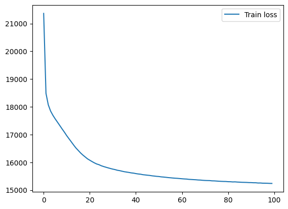
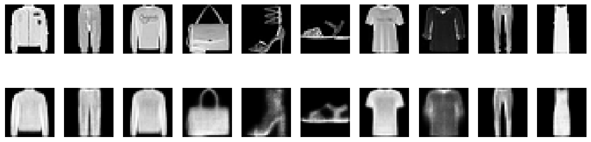

# Fashion-MNIST Variational Autoencoder


## Architecture

**Encoder**
- Dynamically built with the number of convolutional and fully-connected layers as constructor parameters, with channel counts and layer widths computed automatically based on the target latent dimension and input image size.
- A configurable stack of `Conv2d → LeakyReLU` blocks (channels double each layer, spatial size shrinks with stride-2 convolutions)
- Flatten, followed by a configurable stack of fully connected layers
- Two parallel linear heads output `mu` and `log_var`, parameterizing a diagonal Gaussian posterior over the latent space

**Reparameterization**
- Samples `z = mu + std * epsilon`, where `epsilon ~ N(0, I)`

**Decoder**
- A stack of fully connected layers mapping the latent vector back up to image resolution
- Per-channel linear "heads" reconstruct each output channel independently, followed by a sigmoid activation to constrain outputs to `[0, 1]`

**Loss**
- Reconstruction loss: binary cross-entropy between input and reconstruction
- Regularization: closed-form KL divergence between the learned posterior and a standard normal prior
- Total loss: `BCE + KLD`, summed over all pixels and latent dimensions

---

## Model Parameters

### **Encoder**
- 10 Convolutional Layers
- 6 Hidden Fully Connected Layers
- Latent Dimension: 256

### **Decoder**
- 3 Fully Connected Layers
- Channel Head

### **Kaiming initialization**
- weights are initialized with Kaiming normal initialization matched to the LeakyReLU activation throughout the network.

---

## Results

The model was trained for 100 epochs on Fashion-MNIST with a batch size of 64.




Reconstructions closely resemble the originals — some outputs show mild blurriness. Below is a sample of original images (TOP) and reconstructed ones (BOTTOM) after 100 epochs.



---

## How to run

1. Clone the repository:
```bash
git clone https://github.com/karimm-ai/ViT-emotion-recognition.git
```

2. Create a virtual environment (Optional but recommended)

3. Install requirements
```bash
pip install -r requirements.txt
```

4. Install torch or torch cuda. I use the below torch cuda wheel but it's dependent on the GPU. Mine is RTX5070 8GB.
```bash
pip install --pre torch torchvision --index-url https://download.pytorch.org/whl/nightly/cu128
```

5. Run notebook cells

---

## Future Work

- Implement convolutional (rather than fully connected) decoder

---

This project is for educational and research purposes.

---